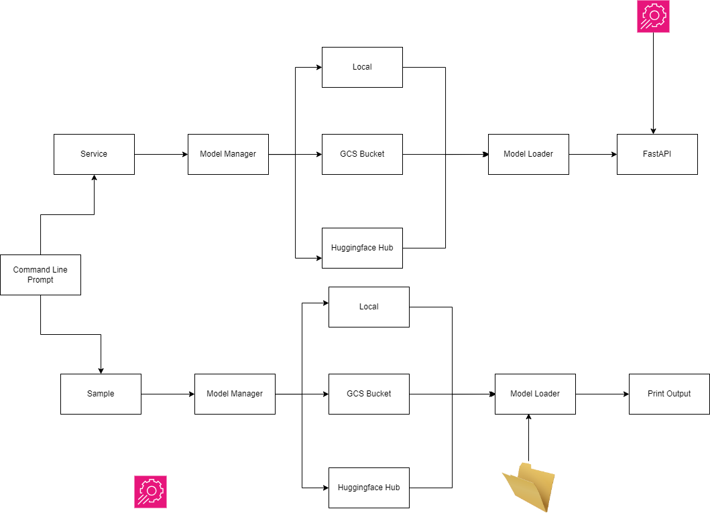

# TEB Zero-Shot Classification Case Project

<div style="text-align:center;">
    
</div>

This project is for the TEB Arf interview. Project 
basically 
constructs a zero-shot classification API.


## Table of Contents
- [Requirements](#requirements)
- [Introduction](#introduction)
- [Installation](#installation)
- [Usage](#usage)
- [Questions](#questions)
- [TODO](#todo)
- [License](#license)


## Requirements

```
uvicorn~=0.27.0.post1
fastapi~=0.109.2
pydantic~=2.6.1
transformers~=4.37.2
setuptools~=68.2.2
pyyaml~=6.0.1
google-cloud-storage~=2.14.0
```

## Introduction

<div style="text-align:center;">
    
</div>


Available Models in GCS Bucket:
    
    - models--facebook--bart-base
    - models--facebook--bart-large-mnli


This code base assumes model will be a huggingface model and 
it will have a structure below:

- model_name
  - .no_exist
  - refs
  - snapshots

This code actually doesn't handle multiple snapshots for Huggingface
model.

Parametrization of the sentiments and intents is important because while we deploy it for various use cases, 
then we could need customize the sentiments and intents, It will ease the deployment process.

I'm making a static website about the API, because while only sharing API and its related tools, there could be many misunderstanding about it, and it is hard to make it work without proper communication.
We're creating a homepage for these purposes for client or user in the compan. They will have a proper guidance to use the Zero-Shot Classification API.


## Installation

We have only two installation options. Installation from source code will be available 
for the new versions of the API.

### Using Github


1. Clone the repository from Github:

    ```git clone https://github.com/alaeddingurel/interview.git```

2. Change the directory into `interview` folder

    ``` cd interview ```

3. Download using setup.py

    ```python setup.py install```

### Using Wheel


1. Download wheel file from the v.0.0.1:
    You could find it in https://github.com/alaeddingurel/interview/releases

2. Change the directory into `interview` folder

    ``` pip install whl_file ```


## Usage

There are two modes of this application `sample` and `service`.

### Sample
Sample mode is just for simple evaluation of the predefined text in the `data` folder which
includes multi-turn conversation between the client and the chatbot (or vendor).
You could run this mode by testing the subcomponents or some parts of the necessary libraries
are working in your system as expected.

You could run it by using the command below:
```bash
interview-service --mode sample
```

### Service
Service mode is using FastAPI in order to construct a service in your local system.

You could run it by using the command below:

```bash
interview-service --mode service
```

You can check the possible endpoints for the API.

If you want to change the configurations for the project. You can change 
the `config.yaml` in the config `config` folder.

## Questions

1 - What are the advantages and disadvantages of using Zero-Shot? How to make this system Turkish
can we bring? What are your suggestions?

- The advantages of using the zero-shot approach is that we don't need to finetune anything, for that 
reason we have the advantage of reduces cost and time for deployment. We could make fast prototypes 
using zero-shot approach.


- One of the disadvantage is the performance of the model. Because it hasn't been finetuned by any labelled data, the 
probability distribution of the models output wouldn't be that much great.


- Simplest way to make zero-shot for Turkish language is to use an english model and convert english prompts and 
its related labels into Turkish. (We could use multilingual pretrained models like mBART)


- Other options could be finetuning the pretrained language model using labelled dataset in Turkish Language. Then, 
we could hypothesize that it could improve the performance.

  
2 - We assume that we have an API that does Speech-To-Text conversion and a gRPC system that publishes the transcripts
. Consider another gRPC system that listens and publishes this system and make an inference for the sentiment and intent for the provided transcript. What problems can happen with such a system?
What needs to be considered?

- Performance of the Speech-to-text system could be low or could do spelling errors in the output.
There could be issues like segmentation errors. For this reason, we could need to implement a spelling correction 
system which corrects the output of the speech-to-text system, otherwise it could affect the performance of the 
sentiment analysis and intent classification tasks.


- Inference time of the classification models should be optimized because it could lead higher latency. Quantization or parallelization of the
model could be considered.


- Other possible problem is we assume that our other system sends a request to speech-to-text system, 
then we are bound to text-to-speech service, because I assume our text-to-speech system could be slower than 
our sentiment and intent classification models. Then we need to consider scaling our text-to-speech system.
I assume we have 100.000 request in a minute, then we will have a queue in the text-to-speech system.


- There could be errors related to text-to-speech system and our sentiment and intent classification system,
then we need to have a backup system which deploys automatically for disasters.


- Inconsistent dependency management could be problem, if our systems and our codes use 
open-source libraries without explicity mentioning the versions of them, then we could 
face issues like behaviour changing, then we need to be sure that we're explicitly mentionin our dependency 
versions.


- There are other issue which is typosquatting, we need to be sure that we're using the exactly names of the
libraries without memorizing and double check them. Our data is sensitive then, we cannot risk to be leaked.


-  We need to be sure that we don't leak any of the data gathered from various data sources to the client.
I assume that our data is sensitive.


- If our api is publishing through public then we need authentication services in order to avoid 
malicious behaviours.


- Our system could have biases for some use cases, then we need to be sure that
we don't have any biases for our use case.


- For the sentiment and intent classification use cases, our model could drift which means that its performance
could change or diminish according to the external factors like changing the language patterns.


### TODO

    - There are repetitive parts in model downloader. Some abstraction could be useful
    - We need to add unit test in order to test Manager and other functionality.
    - We could add other functionality like using multiple models outputs and merging them such as
        mean averaging, weighted average and other possible methodologies.
    - Host and Port could be parametrized


Some possible improvements:

    - OnnxRuntime
    - Bulk Inference (Batch Inference)

### LICENSE
This project is licensed under MIT License.